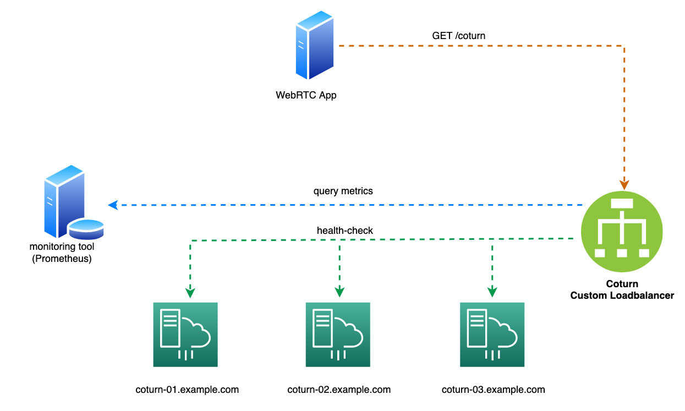

# Coturn Custom Loadbalancer
[](https://opensource.org/licenses/MIT)

## Overview
Application to loadbalance across multiple TURN servers (Coturn) for the purpose of 'high availability' and 'scalability'

## About TURN and Coturn
TURN Server is a VoIP media traffic NAT traversal server and gateway.
STUN/TURN servers are used in a number of peer-to-peer communication application (eg: WebRTC API) for the purpose of NAT traversal.
[Coturn](https://github.com/coturn/coturn) project is a free open source implementation of TURN and STUN Server

## Implementation
Select the best TURN server based on the following criteria:

a) **Health-check**: perform periodic endpoint health-check to ensure only healthy TURN servers are selected.

b) **Load-balancing**: periodically check the ‘load’ of each healthy TURN server using metrics derived from monitoring tool (eg. of metrics: N/W usage, TCP connections, etc.)

## Parameters
a) Health-check module:
```
intervalSeconds        ## interval between health-checks
timeoutSeconds         ## health-check time-out
successThreshold       ## number of checks before considering an unhealthy endpoint healthy
failureThreshold       ## number of checks before considering a healthy endpoint unhealthy
port                   ## TURN server endpoint port
turnAddressMapping     ## Public/Private address mapping of TURN servers
                       ## Private address used to query metrics, Public address used in api response
```

 b) Load-balancing module:
```
algorithm            ## load-balancing algorithm (metrics/random)
intervalMinutes      ## interval between checking TURN server load
durationMinutes      ## duration to query metrics (eg: last 5 mins)
prometheusEndpoint   ## Prometheus monitoring server endpoint (optional)
prometheusPort       ## Prometheus endpoint port (optional)
prometehusQuery      ## Prometheus query (optional)
```

## Architecture


## Requirements
- Python v3.10
- Prometheus endpoint should be accessible _(if using Load-balancing algorithm as 'metrics')_
- Coturn endpoints should be accessible

## Deployment _(non container environment)_

Update config file _(coturn_loadbalancer.yaml)_ with required details

Run application:
```
$ python coturn_loadbalancer.py --config-file coturn_loadbalancer.yaml
```


## Example api response
```
GET http://localhost:8080/coturn
```
```
{
    {"turn_data": {"coturn-01.example.com": {"failed_checks": 0, "healthy": true, "initial": 0, "success_th": 3},
                   "coturn-02.example.com": {"failed_checks": 0, "healthy": true, "initial": 0, "success_th": 3}},
    "turn_server": "coturn-02.example.com" }
}
```

## License
Code released under the [MIT License](https://opensource.org/licenses/MIT)
